# Supported Municipalities

This integration supports **77 municipalities** with verified water consumption data.

Last updated: 2026-02-10

## Municipality List

| Logo | Customer ID | Hebrew Name |
|------|------------|-------------|
|  | 999999 | onecity |
|  | 51240 | אפעל |
|  | 836500 | אפרת |
|  | 813090 | אלעד |
|  | 835600 | אלקנה |
| 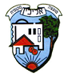 | 600410 | אליכין |
| 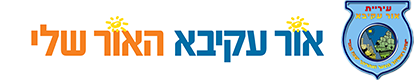 | 510200 | אור עקיבא |
|  | 524000 | אור יהודה |
|  | 390000 | באר שבע |
|  | 537800 | ביתר עילית |
|  | 698000 | בנימינה-גבעת עדה |
|  | 62410 | בני שמעון |
|  | 261000 | בני ברק |
|  | 262000 | בת ים |
|  | 43300 | גזר |
|  | 807300 | גבעת זאב |
| 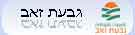 | 837300 | גבעת זאב - חינוך |
| 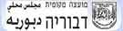 | 904890 | דבוריה |
|  | 322000 | דימונה |
|  | 42200 | דרום השרון |
|  | 62540 | הערבה התיכונה |
|  | 264000 | הרצליה |
| 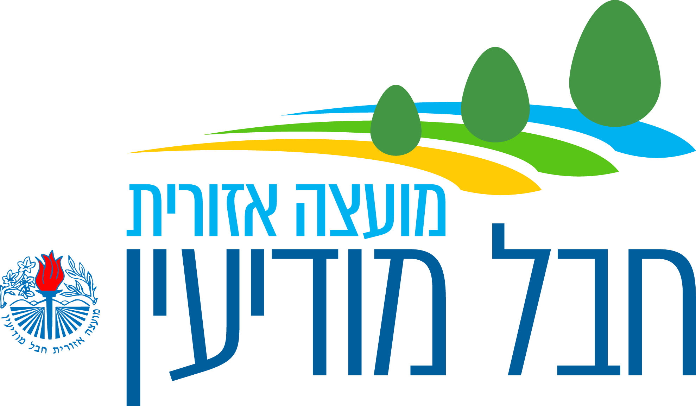 | 42250 | חבל מודיעין |
|  | 32150 | חוף הכרמל |
|  | 913030 | חורה |
|  | 904960 | חורפיש |
|  | 520340 | חצור הגלילית |
| 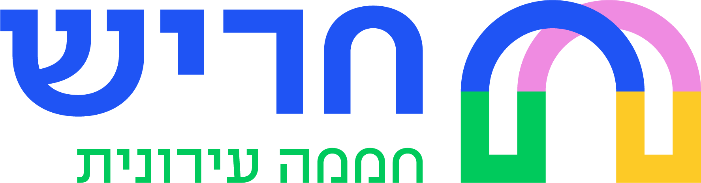 | 812470 | חריש |
| 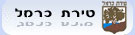 | 521000 | טירת כרמל |
|  | 594000 | יהוד - מונוסון |
|  | 904990 | יפיע |
| 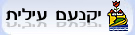 | 602400 | יקנעם |
|  | 800470 | כפר תבור |
| 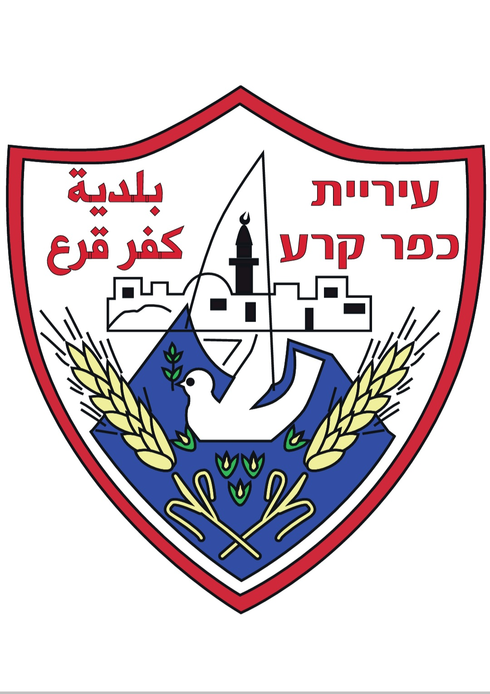 | 906540 | כפר קרע |
|  | 712710 | להבים |
| 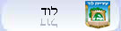 | 370000 | לוד |
| 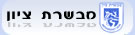 | 510150 | מבשרת ציון |
|  | 23130 | מגידו |
| 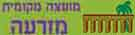 | 905170 | מזרעה |
|  | 700430 | מטולה |
|  | 697100 | מי הוד השרון |
| 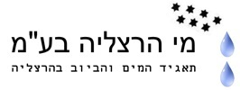 | 264100 | מי הרצליה |
| 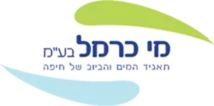 | 140100 | מי כרמל |
| 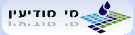 | 812100 | מי מודיעין |
| 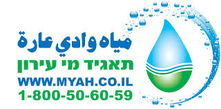 | 927150 | מי עירון |
|  | 472050 | מי ציונה- נס ציונה |
|  | 474050 | מי ציונה- מזכרת בתיה |
|  | 473050 | מי ציונה- קריית עקרון |
|  | 367700 | מי רקת |
| 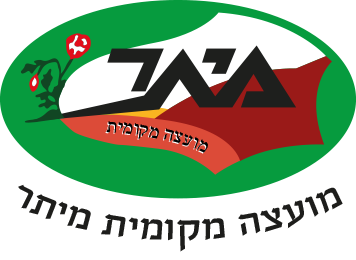 | 712680 | מיתר |
|  | 712730 | מכבים רעות |
|  | 880300 | מעיינות העמקים |
|  | 836160 | מעלה אדומים |
| 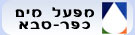 | 269100 | מפעל המים כפר סבא |
|  | 500990 | מצפה רמון |
| 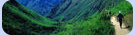 | 2000 | מרכז מסחרי שהם |
|  | 24560 | משגב |
|  | 502460 | נתיבות |
|  | 705870 | סביון |
|  | 975000 | סח'נין |
|  | 905300 | עילבון |
| 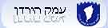 | 22060 | עמק הירדן |
|  | 377000 | עפולה |
| 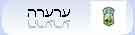 | 906370 | ערערה |
|  | 600530 | עתלית |
|  | 801710 | פרדסיה |
|  | 813080 | צורן |
|  | 835570 | קדומים |
|  | 841000 | קצרין |
|  | 426200 | קרית אונו |
|  | 395000 | קרית ביאליק |
| 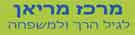 | 326310 | קרית גת ? מרכז מריאן |
|  | 284000 | רחובות |
|  | 801220 | רמת ישי |
|  | 61340 | שפיר |
|  | 150000 | תל אביב |
| 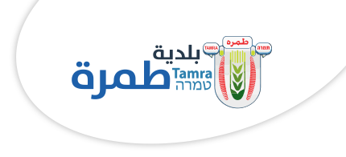 | 989000 | תמרה |


## Verification Method

Municipalities are verified to have water consumption support by checking:
1. Portal page at
   `https://city4u.co.il/PortalServicesSite/_portal/{{CUSTOMER_ID}}`
2. Presence of water menu (מים) under personal area (איזור אישי)
3. Presence of "צריכת המים שלי" (My water consumption) menu item

## Updating This List

This file is automatically generated by:
```bash
python3 scripts/update_municipalities.py
```
